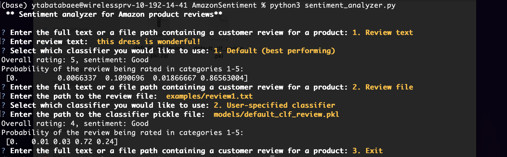

# Sentiment analysis on Amazon product reviews
This repository contains the codes and data for the final project of CS 410: Text Information Systems course at UIUC in Fall 2023. The main goal of this project is to build a tool for sentiment analysis of Amazon product reviews and perform sentiment analysis on a large collection of reviews from different categories of products, such as clothes, appliances, software, etc. In addition to a sentiment analysis software, this work provides insight about various factors that correlate with the sentiment of a review, such as the type of words/phrases used, length of the reviews, etc, and also compare different machine learning classifiers for sentiment analysis on this data.

This README includes the overview and the documentation of the project, and the other files are:
- Project proposal: [Project_Proposal.pdf](https://github.com/ytabatabaee/AmazonSentiment/blob/main/Project_Proposal.pdf)
- Project progress report: [Project_progress_report.pdf](https://github.com/ytabatabaee/AmazonSentiment/blob/main/Project_progress_report.pdf)
- Tutorial video: TBD
- Documentation of codes and results: The [/src](https://github.com/ytabatabaee/AmazonSentiment/tree/main/src) directory includes all the code. The jupyter notebook [/src/Amazon_reviews_analysis.ipynb](https://github.com/ytabatabaee/AmazonSentiment/blob/main/src/Amazon_reviews_analysis.ipynb) contains a report on the results of the data analysis on the review data and training the sentiment analysis classifiers.

## Contents
- [Dependencies](#dependencies)
- [Software usage](#software)
- [Data](#data)
- [Codes](#codes)
  * [Preprocessing](#preprocessing)
  * [Data analysis](#data-analysis)
  * [Sentiment analysis](#training-and-evaluation)
- [Implementation](#implementation)
- [Example use-cases](#examples)
- [Pretrained classifiers](#pretrained-models)
- [Results](#results)
- [Acknowledgements](#acknowledgements)

## Dependencies
The Amazon sentiment analysis software requires [Python 3.7+](https://www.python.org) and uses the following python packages: [scikit-learn (v1.2.2)](https://scikit-learn.org/stable/index.html), [questionary](https://pypi.org/project/questionary/), [nltk](https://www.nltk.org/), [Numpy](https://numpy.org) and [Pandas](https://pandas.pydata.org/), [seaborn (v0.13.0+)](https://seaborn.pydata.org/).

If you have Python3 and pip, use `pip install -r requirements.txt` to install all dependencies.

## Software usage
The sentiment analysis tool is implemented as a command-line software that takes a product review and a pre-trained sentiment classifier as input and predicts the rating (an integer between 1 to 5) and the sentiment of the review (Good, Bad, Average), as well as a probability distribution over the five rating classes.

The software has two options for the input review, where the user can either enter the review text directly, or enter a file path containing the review. There are also two options for the sentiment classifier: the user can choose a default classifier which was the best performing classifier in our experiments, or enter a path to a pre-trained classifier (*the file should be in pickle format (.pkl)*).

### Usage instructions
To run the software, first clone the github repository.

`$ git clone https://github.com/ytabatabaee/AmazonSentiment.git`

If you don't have Python 3.7+, you can first create a virtual environment with `conda create -n py37 python=3.7`, and activate it with `source activate py37`. You can then install the dependencies with `pip install -r requirements.txt`.

To run the software, run

`$ python3 sentiment_analyzer.py`

 in the command-line and answer the questions as they appear in the prompt. Further details about answering the prompt is explained in the tutorial video. In the simplest case, where the user just wants the sentiment of an input review text, you can select *option 1* for both review text and sentiment analyzer questions.

The figure below shows an example of running the software.

## Data

The data used in this project is part of the [Amazon reviews dataset from UCSD](https://nijianmo.github.io/amazon/index.html) that was published in 2018, and contains more than 233 million Amazon reviews between the years 1996 to 2018 from 29 different product categories, as well as additional information and metadata for each product. Since this dataset was very large and analyzing all of it was not feasible, we sampled a small collection of it containing at most 200,000 reviews from each of the 8 selected product categories: Fashion, Software, Appliances, Gift Cards, Magazine Subscriptions, Prime Pantry, Luxury Beauty, All Beauty. The total number of analyzed reviews was 1,436,883.

The selected datasets from these 8 categories are available at [this Google Drive link](https://drive.google.com/drive/folders/1V6-7o-2mcjb5A1VQZEFVC3H-xtkz0PyG?usp=sharing).

## Overview of the Code

## Implementation

## Example tests

We provide five example test cases in the [examples/](https://github.com/ytabatabaee/AmazonSentiment/tree/main/examples) directory. Each test case has a full review (called `review$i.txt`), a review summary (`summary$i.txt`) and the true sentiment of the review (`sentiment$i.txt`), which can be used for verification. To test the software, you can enter the path to one of these reviews/summaries as input, or just copy paste the text directly.

## Pretrained classifiers

We provide the default pre-trained classifier that had the best performance in our experiments in [models/default_clf_review.pkl.zip](https://github.com/ytabatabaee/AmazonSentiment/blob/main/models/default_clf_review.pkl.zip) and the other classifiers used in our experiments are available in [this Google Drive link](https://drive.google.com/drive/folders/1w-muQMsE5ft5N56-1vsrtl1P8hRq7ink?usp=sharing). The software by default uses `default_clf_review.pkl` as a classifier, but it can also take an arbitrary pre-trained classifier as input, by specifying its path.

## Results

Below we summarize the testing accuracy of the 10 sentiment analysis classifiers we trained on 40K reviews. More details are available in the jupyter notebook at [src/Amazon_reviews_analysis.ipynb](https://github.com/ytabatabaee/AmazonSentiment/blob/main/src/Amazon_reviews_analysis.ipynb).

| Classifier      | Feature vectorization    |Testing accuracy    |
| ----------- | ----------- | ----------- |
| Random Forest    |   Count Vectorizer      | 0.6797668107347472 |
| Random Forest    |   TF-IDF      | 0.6833852648507388 |
| Multinomial Naive Bayes    |   Count Vectorizer      |  0.6804703990350789 |
| Multinomial Naive Bayes    |   TF-IDF      |  0.6674037591717761 |
| Complement Naive Bayes    |    Count Vectorizer     | 0.6628806915267866 |
| Complement Naive Bayes    |     TF-IDF    | 0.6260930746808725 |
| Bernoulli Naive Bayes    |     Count Vectorizer    | 0.5966428786812745 |
| Bernoulli Naive Bayes    |     TF-IDF    | 0.6066941401145843 |
| SGD Classifier     |     Count Vectorizer    |     0.6949442154990452     |
| SGD Classifier     |     TF-IDF    |     0.6925319127550508     |

## Acknowledgements
This project uses some ideas from this report https://cs229.stanford.edu/proj2018/report/122.pdf and this github repository https://github.com/avinash-vk/Sentiment-analysis-on-amazon-reviews.
